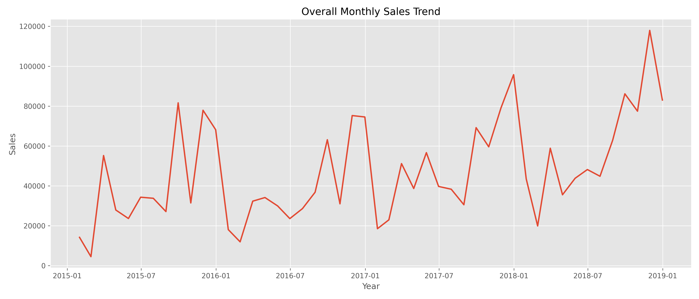
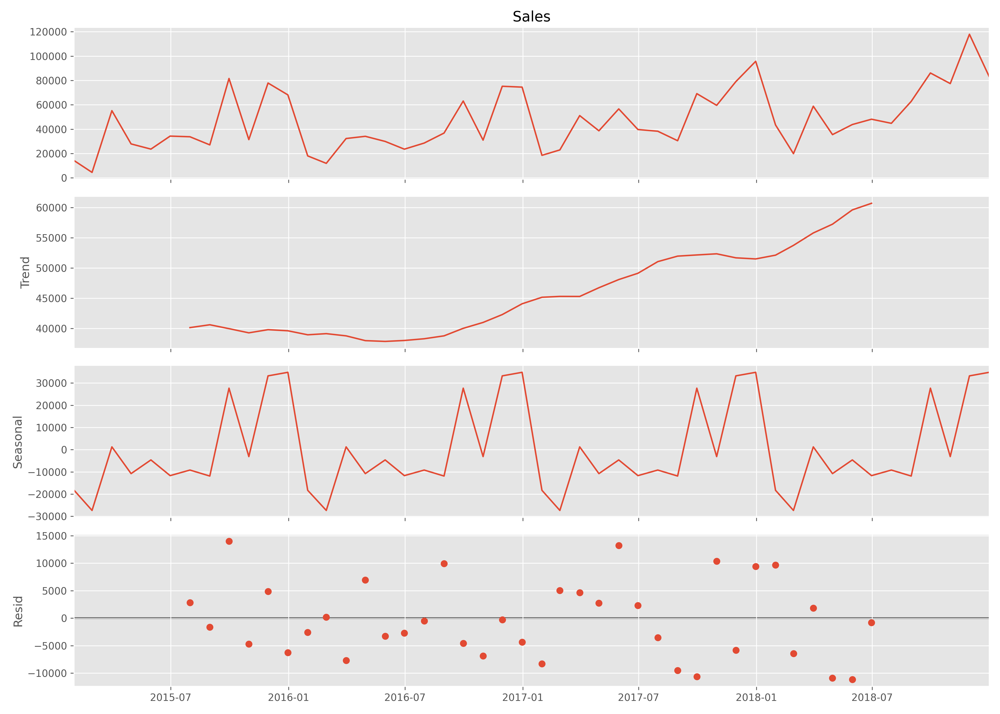
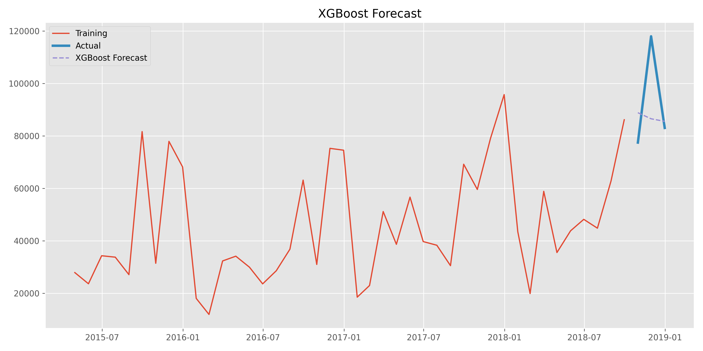
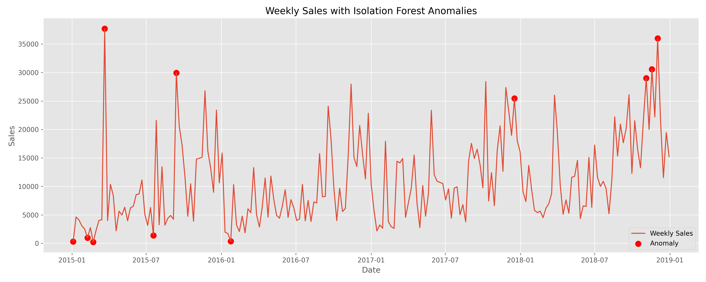
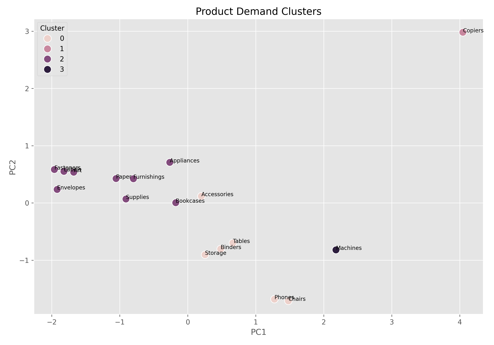

# Intelligent Sales Forecasting System

An end-to-end Data Science project that predicts future retail sales, detects unusual demand patterns, segments products based on demand behavior, and provides an interactive Streamlit dashboard for business decision-making.

---

## Project Overview

Accurate demand forecasting is essential for inventory planning in retail businesses. Overstocking increases storage costs, while understocking results in lost sales and poor customer satisfaction.

This project analyzes four years of retail sales data to:

- Forecast future sales using multiple forecasting models
- Detect unusual sales spikes and drops
- Segment products based on demand behavior
- Present insights through an interactive Streamlit dashboard

---

## Features

- Exploratory Data Analysis (EDA)
- Time Series Decomposition
- Sales Forecasting
  - SARIMA
  - Facebook Prophet
  - XGBoost
- Anomaly Detection
  - Isolation Forest
  - Z-Score
- Product Demand Segmentation
  - K-Means Clustering
  - PCA Visualization
- Interactive Streamlit Dashboard

---

## Technologies Used

- Python
- Pandas
- NumPy
- Matplotlib
- Seaborn
- Plotly
- Scikit-Learn
- Statsmodels
- Prophet
- XGBoost
- Streamlit

---

## Project Structure

```text
SalesForecasting_Mrinal/

│── analysis.ipynb
│── app.py
│── train.csv
│── requirements.txt
│── summary.pdf
│
├── charts/
├── data/
├── models/
```

---

# Results

## Forecast Model Performance

| Model | MAE | RMSE | MAPE |
|-------|------:|------:|------:|
| SARIMA | 20,581 | 22,191 | 21.94% |
| Prophet | 20,251 | 22,318 | 21.86% |
| **XGBoost** | **15,102** | **19,348** | **14.78%** |

**Best Model:** XGBoost

---

# Visualizations

## Monthly Sales Trend



---

## Time Series Decomposition



---

## XGBoost Forecast



---

## Anomaly Detection



---

## Product Demand Clustering



---

# Key Business Insights

- Technology generated the highest overall revenue.
- The East region showed the most consistent long-term sales growth.
- Sales consistently increased during September–December, indicating strong seasonality.
- XGBoost achieved the highest forecasting accuracy among all evaluated models.
- The West region is expected to experience the strongest future sales growth.
- Four distinct demand segments were identified to support inventory planning.

---

# Running the Project

Install dependencies

```bash
pip install -r requirements.txt
```

Run the Streamlit app

```bash
streamlit run app.py
```

---

# Dashboard

The Streamlit dashboard provides:

- Sales Overview
- Forecast Explorer
- Anomaly Report
- Product Demand Segments


---

# Future Improvements

- Include external factors such as holidays and promotions.
- Deploy forecasting models using cloud APIs.
- Add real-time inventory monitoring.
- Automate model retraining with new sales data.
